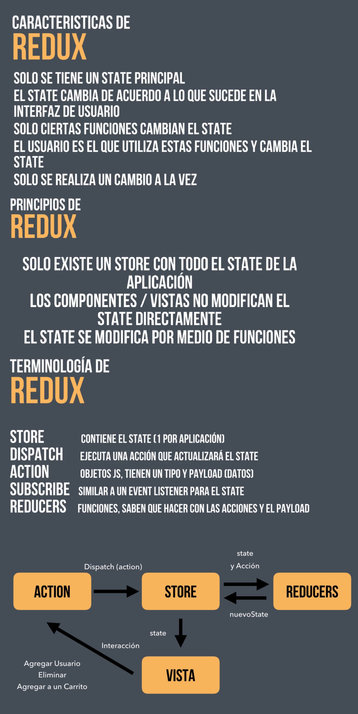

<h1>CRUD-REDUX</h1>

<h2>CRUD-REDUX: STACK: REACT.JS - AXIOS - REDUX - REACT-ROUTER-DOM - SWEETALERT2</h2>

[IR AHORA](https://crud-redux-alanshalem.netlify.app/)

# .env.development.local
```sh
http://localhost:4000
```
# .env.production.local
```sh
https://my-json-server.typicode.com/alanshalem/crud-redux/
```

<h2>PREVIEW 🚀</h2>


<hr />


